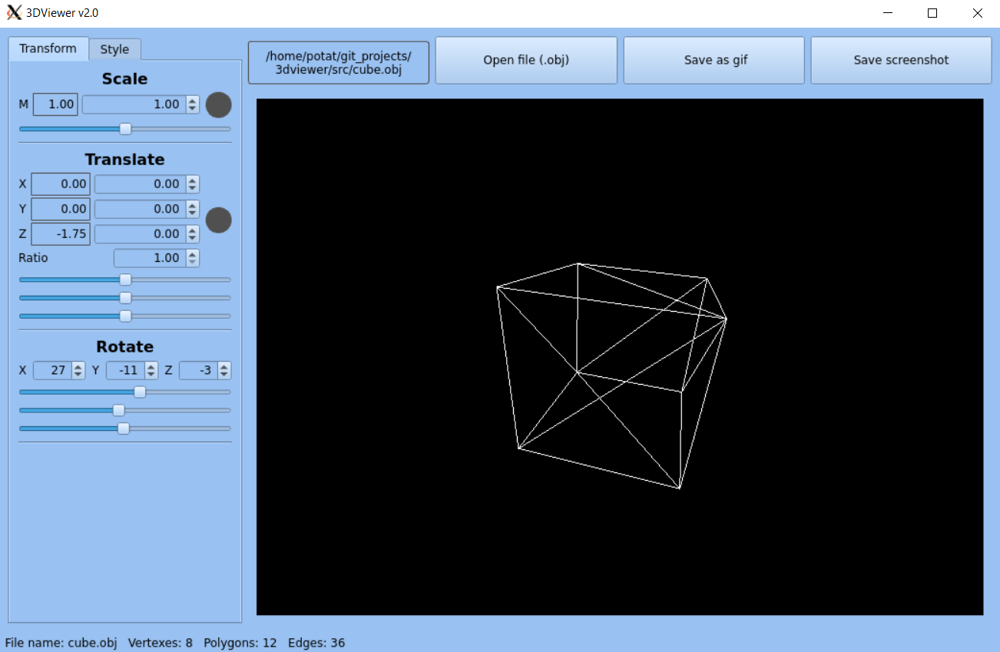
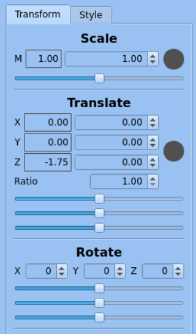
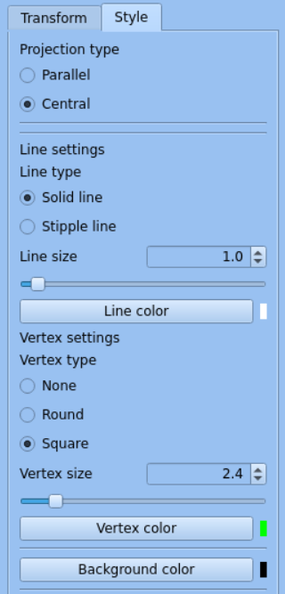
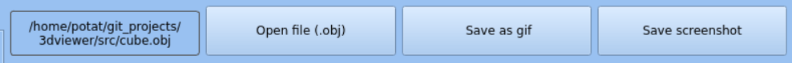

# 3dviewer
Программа для просмотра .obj файлов в виде каркасной модели.
- Созавалась на Ubuntu LTS 22.04, кроссплатформенность при создании не рассматривалась.

## Основные элементы
### Главное окно

Главное окно содержит поле отображения моделей, разделы преобразования модели и изменения параметров изображения. Также в верхней части окна находятся кнопки выбора отображаемой модели и сохранения скриншота/гиф изображения.

### Раздел преобразований

- Блок Scale отвечает за масштабирование модели. Слайдер позволяет произвольно изменять масштаб, если же необходимо более точное масштабирование, то в спинбоксе можно задать требуемый коэффициент масштабирования и применить его нажатием на круглую кнопку правее. В левой части блока указан текущий коэффициент масштабирования.
- Блок Translate отвечает за перемещение модели в пространстве. Перемещение возможно в трёх измерениях, из-за чего доступно три слайдера, спинбокса и окна отображения текущих координат. Спинбокс Ratio позволяет увеличить или уменьшить применяемое перемещение.
- Блок Rotate отвечает за вращение модели относительно своего центра. Слайдеры позволяет произвольно изменять положение фигуры, а спинбоксы отображают текущие углы поворота и позволяют задать угол поворота более точно.

### Раздел изменения параметров изображения

- Блок Projection type позволяет изменять вид проекции отображения модели. Доступна параллельная и центральная проекции.
- Блок Line settings отвечает за настройки отображения линий. 
- - Line type позволяет изменять тип линий, доступны сплошные и прерывистые. 
- - Line size позволяет изменять толщину линий.
- - Line color позволяет изменять цвет линий. 

- Блок Vertex settings отвечает за настройки отображения узлов. 
- - Vertex type позволяет изменять тип узлов, можно не отображать узлы, отобрражать их в виде кругов или в виде квадратов. 
- - Vertex size позволяет изменять размер узлов.
- - Vertex color позволяет изменять цвет узлов.

- Блок Background color отвечает за цвет фона поля отображения моделей.

Указанные в этом разделе настройки сохраняются в файле Settings.ini и подгружаются оттуда при перезапуске программы.

### Верхняя часть окна

- Окно отобржения пути открытой модели.
- Кнопка открытия моделей.
- Кнопка сохранения .gif
- Кнопка сохранения скриншота в .bmp или .jpeg формате.
